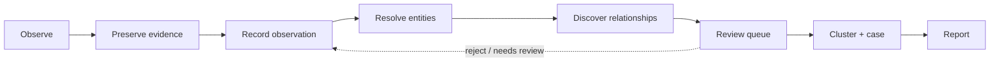
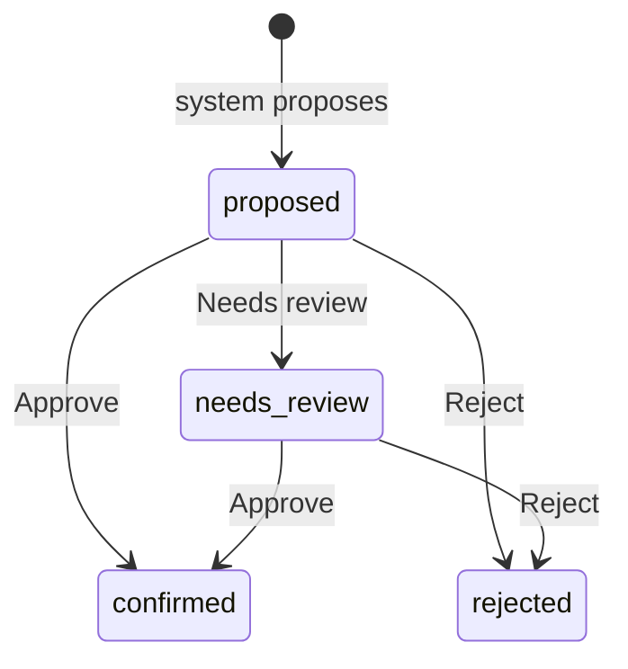

# Analyst Workflow

This document describes how an analyst works in ORCA, from a raw observation to a
reviewed report. The workflow is the operational expression of the core principles:
the system preserves and proposes; the analyst decides.

## The shape of the work

Each step adds structure without discarding the layer beneath it. A report rests on a
case, which is a view over clusters, relationships, observations, and the evidence
that supports them. You can always walk back down the chain.

## 1. Preserve evidence

Before an observation is recorded, the artifact that supports it is preserved.
Evidence is captured, hashed (SHA-256), and stored immutably. The hash is the
integrity anchor; the artifact can be re-verified later. Evidence with no observation
is allowed (it is preserved material); an observation with no source is not.

## 2. Record an observation

An observation is a single recorded fact: *what* was observed, *when*, from *which
source*, by *which collector*, with optional *location* and *notes*, at a stated
*confidence*. It links to the evidence that supports it.

Observations are **append-only**. If something was wrong, you record a new
observation that references the old one — you do not edit the original. The record
should always show what was known at the time.

## 3. Resolve entities

Observations reference entities: phone numbers, aliases, accounts, usernames,
locations, vehicles, images, advertisements, tattoo markers. Entities are
deduplicated by type and canonical value — the same phone number seen in two
advertisements is one entity referenced by two observations.

Entity resolution can be assisted (the system proposes a canonical value) but the
analyst confirms ambiguous matches.

## 4. Discover relationships

When two entities share something — a phone number, an image, a location, an account,
or simply co-occurrence in an observation — that is a candidate **relationship**. The
system can propose these from the evidence. Every proposed relationship:

- references the **supporting observations** that justify it,
- carries a **confidence** score,
- and is marked `origin = system_proposed`, `status = proposed`.

A proposed relationship is never silently added to the confirmed graph. It goes to the
review queue.

## 5. The review queue — the most important screen

The review queue is where "AI proposes, analysts decide" actually happens. It is the
single most important screen in the product. Nothing the system infers becomes
confirmed knowledge without passing through it.

Every review item displays four things:

1. **Why it was surfaced** — the rationale. For example: *"shared_phone:
   +1-555-0142 appears in observations O-1183 and O-1190."* No item appears without an
   explanation.
2. **Supporting evidence** — the observations and the underlying evidence artifacts,
   viewable in place.
3. **Confidence level** — the score and its qualitative band.
4. **Analyst actions** — what the analyst can do about it.

### Actions

| Action         | Effect                                                                       |
| -------------- | ---------------------------------------------------------------------------- |
| **Approve**    | Confirms the item. Status → `confirmed`. Written to the audit log.            |
| **Reject**     | Dismisses the item. Status → `rejected`. Written to the audit log.            |
| **Needs review**| Defers the item for more information or a second opinion. Status → `needs_review`. |

Every Approve and Reject is recorded against the analyst who made it. A confirmed
relationship can always be traced to a person and the evidence they saw. This is what
makes assessments explainable after the fact.

## 6. Cluster and case

Confirmed relationships, together with their entities and observations, form
**clusters** — candidate patterns. An analyst working a line of inquiry creates a
**case**: a curated view over the relevant observations, entities, clusters, and
reports.

A case is a *view*, not a container. It references the evidence; it does not own it.
Closing or deleting a case never deletes the underlying observations, entities, or
evidence — those persist, available to the next case. This is principle 7
(relationships persist longer than cases) and principle 8 (cases are views of
evidence) in daily practice.

## 7. Report

A **report** is the human-readable analytic product authored under a case. It cites
the observations and evidence it rests on, so a reader can verify each claim. Reports
move through `draft → in_review → final`. A report states what the evidence supports;
it does not assert conclusions the evidence cannot carry.

## What the analyst is accountable for

The system can preserve, extract, propose, and explain. It cannot confirm a
relationship, assert an identity, or draw a conclusion. Those are analyst actions,
recorded against the analyst, and auditable. ORCA is built so that the easy path is
the careful one: evidence first, explanation always, decision by a person.

## The dashboard

The dashboard orients the analyst at the start of a session by answering three
questions:

- **What is new?** — recent observations and relationships.
- **What changed?** — recent state transitions.
- **What requires review?** — the count and contents of the review queue.

It also surfaces **system health** so the analyst knows the record they are working
against is intact (databases reachable, evidence store healthy).
