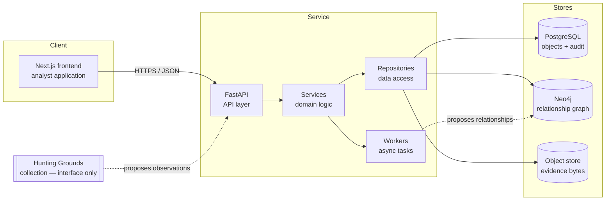
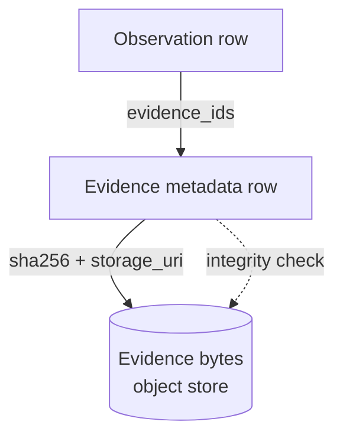
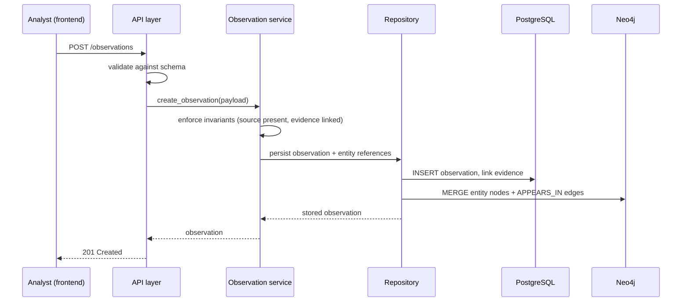
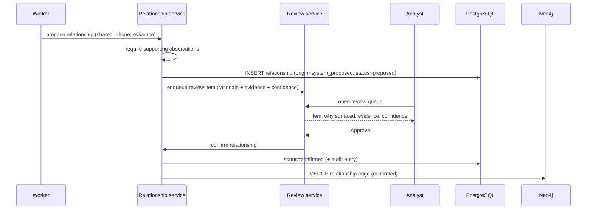
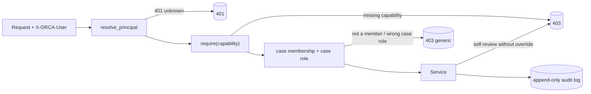

# Architecture

This document describes the shape of ORCA: its components, data stores, and the path
a request takes through the system. It reflects the initial skeleton — interfaces are
defined and the structure is in place; some internals are stubs by design.

## Goals that shape the architecture

- **Evidence is durable and verifiable.** The system of record for evidence is
  append-only and content-addressed.
- **Relationships are queryable as a graph.** Discovery is a graph problem;
  relationships persist independently of cases.
- **Conclusions are derived, not stored as truth.** Cases and reports are views and
  products built over the evidence layer.
- **The system proposes; analysts decide.** Every proposed object flows through a
  review queue before it can be confirmed.

## Component overview

## Layers in the backend

The backend is organized so that each layer has one responsibility and depends only
on the layer beneath it.

| Layer            | Directory                  | Responsibility                                        |
| ---------------- | -------------------------- | ----------------------------------------------------- |
| **API**          | `backend/app/api`          | HTTP routing, request/response schemas, validation.   |
| **Services**     | `backend/app/services`     | Domain logic and the rules of the ontology.           |
| **Repositories** | `backend/app/repositories` | Data access to PostgreSQL, Neo4j, and the object store.|
| **Models**       | `backend/app/models`       | ORM definitions for relational objects.               |
| **Schemas**      | `backend/app/schemas`      | Pydantic models for the API contract.                 |
| **Workers**      | `backend/app/workers`      | Asynchronous tasks (extraction, proposal, indexing).  |
| **Collection**   | `backend/app/collection`   | Hunting Grounds interfaces (definitions only).        |

Dependency direction is strictly downward: `api → services → repositories → stores`.
The API layer never touches a database driver directly; services never build SQL or
Cypher directly. This keeps the ontology rules in one place (services) and the
storage details in another (repositories).

## Why two databases

ORCA uses a **polyglot persistence** model because two questions dominate the work,
and they have different shapes.

### PostgreSQL — the system of record

PostgreSQL stores the canonical objects: observations, entities, evidence metadata,
sources, clusters, cases, reports, review items, and the audit log. It is where
durability, transactions, and integrity constraints live. The ontology invariants
(an observation has a source; a relationship has supporting observations) are
enforced here.

### Neo4j — the relationship graph

Neo4j stores entities as nodes and relationships as edges, mirroring the relational
record. Discovery questions — "what connects these two entities?", "what else shares
this phone number?", "how large is this cluster?" — are graph traversals, and a graph
database answers them directly.

PostgreSQL is authoritative. Neo4j is a derived, queryable projection kept in sync by
the relationship service. If the two ever disagree, PostgreSQL wins and the graph is
rebuilt.

### Object store — evidence bytes

Evidence *metadata* (hash, type, source, URI) lives in PostgreSQL. Evidence *bytes*
(screenshots, archived pages, files) live in an object store, addressed by their
SHA-256 hash. The hash in PostgreSQL is the integrity anchor: a read verifies the
bytes against the recorded hash. See [`security.md`](security.md).

## Request flow: recording an observation

## Request flow: proposing and reviewing a relationship

The "AI proposes, analyst decides" loop is the core of the system.

A proposed relationship exists in PostgreSQL immediately but is marked `proposed`. It
only becomes part of the confirmed graph when an analyst approves it, and the
approval is written to the audit log against that analyst.

## Frontend

The frontend is a Next.js application using the App Router. Each ontology object has
a corresponding screen, plus a dashboard and the review queue. The design is
evidence-first and information dense: calm, professional, minimal visual noise. It is
deliberately **not** a "command center" aesthetic. See
[`frontend/README.md`](../frontend/README.md).

The frontend talks to the backend over JSON. It holds no authority of its own — it
renders evidence and records analyst decisions, which the backend validates and
audits.

## Hunting Grounds (collection) — interface only

"Hunting Grounds" is the future collection engine: monitoring, archiving, entity
extraction, and evidence preservation. In this skeleton it exists as **interface
definitions only** in `backend/app/collection`. No collection logic is implemented.
A collector, when built, will be a producer of observations and evidence through the
same API surface analysts use — it has no privileged path that bypasses review or
audit.

## Deployment shape (local)

`infrastructure/docker-compose.yml` brings up PostgreSQL, Neo4j, and (optionally) the
backend and frontend for local development. Production topology is out of scope for
the skeleton; the roadmap addresses it. See [`roadmap.md`](roadmap.md).

## Authentication & authorization (v0.4)

Authorization is enforced at the API boundary by a capability-based route guard and is
re-checked in the service layer for decisions.

- **Authentication.** A request is resolved to a `Principal` (`app/core/security.py`).
  For local/dev, the `X-ORCA-User` header selects a seeded user; production swaps in real
  credential verification without changing the rest of the stack. Unknown users → 401.
- **Roles & capabilities.** Six roles map to capabilities in `app/core/rbac.py`. The
  route guard `require(capability)` (`app/api/deps.py`) returns 403 on a missing
  capability. See [`v0.4_auth_rbac.md`](v0.4_auth_rbac.md) for the full matrix.
- **Separation of duties.** A user cannot decide on their own proposed intelligence; an
  admin override bypasses this and is recorded as a distinct audit event.
- **Case membership (v0.6).** On top of RBAC, `case_members` (case_id, user_id,
  case_role, status) enforces **need-to-know**: a non-admin must hold an *active*
  membership to see or act on a case, and the per-case role decides what they may do.
  `app/services/case_access.py` centralises the predicates; the case-keyed guards in
  `app/api/deps.py` (`require_case_material_read`, `require_case_audit_access`,
  `require_case_membership_management`, …) and service-layer checks scope every read,
  mutation, review, export, and listing. Denials are a single generic 403 that never
  reveals a case's existence. See [`v0.6_case_membership.md`](v0.6_case_membership.md).

## Cross-cutting concerns

- **AuthN/AuthZ.** Role-based access control (six roles) is described in
  [`v0.4_auth_rbac.md`](v0.4_auth_rbac.md) and [`security.md`](security.md), implemented
  in `backend/app/core/rbac.py` and enforced by `app/api/deps.py::require`. Per-case
  need-to-know scoping (v0.6) layers on top — see
  [`v0.6_case_membership.md`](v0.6_case_membership.md) and `app/services/case_access.py`.
- **Audit logging.** Every state transition that confirms, rejects, or deletes is
  recorded. The audit log is append-only.
- **Configuration.** Settings load from environment variables (`backend/app/core/config.py`).
  Templates are in `infrastructure/env` and each component's `.env.example`.
