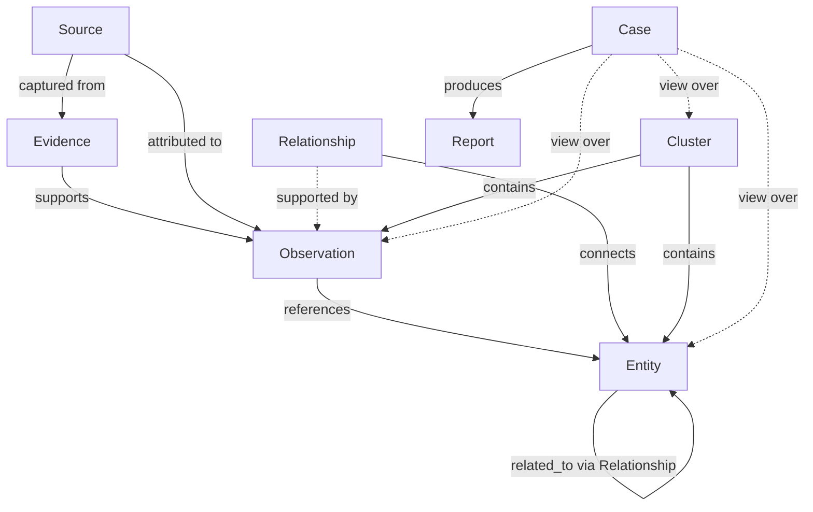

# ORCA Ontology v0.1

The ontology defines the objects ORCA records, the relationships between them, and
the rules that keep evidence traceable. It is the contract shared by the database,
the API, and the analyst interface. The machine-readable form lives in
[`/ontology/schema`](../ontology/schema); this document is the narrative reference.

> **Version policy.** This is `v0.1`. Object types and relationship types are
> additive within a major version. Removing or renaming a type, or changing the
> meaning of a property, requires a version bump and a migration.

## Object types

ORCA defines eight core object types:

| Object         | One-line definition                                                        |
| -------------- | -------------------------------------------------------------------------- |
| `Observation`  | A single recorded fact, attributed to a source and a collector, at a time. |
| `Entity`       | A real-world thing referenced by observations (phone, alias, image, …).    |
| `Relationship` | An evidence-backed link between two entities.                              |
| `Evidence`     | A preserved artifact that supports an observation.                         |
| `Source`       | Where an observation came from.                                            |
| `Cluster`      | A grouping of related entities and observations.                           |
| `Case`         | An analyst work product; a view over evidence, not a source of truth.      |
| `Report`       | An authored analytic product derived from a case.                          |

## Shared concepts

### Identifiers

Every object has a UUID `id`. Identifiers are stable and never reused.

### Confidence

`confidence` is a float in the closed interval `[0.0, 1.0]`. For human reading it
maps to qualitative bands:

| Band        | Range        | Meaning                                                  |
| ----------- | ------------ | -------------------------------------------------------- |
| `unverified`| `0.00–0.19`  | Recorded, not yet assessed.                              |
| `low`       | `0.20–0.39`  | Weak support.                                            |
| `medium`    | `0.40–0.69`  | Moderate, corroborating support.                         |
| `high`      | `0.70–0.89`  | Strong support.                                          |
| `confirmed` | `0.90–1.00`  | Analyst-confirmed against evidence.                      |

Confidence describes the strength of *evidentiary support*, not a probability of
guilt. A `confirmed` relationship means an analyst verified the link against the
evidence — not that any conclusion about a person has been reached.

### Origin and status

Objects that can be produced by the system carry two fields that encode the
"AI proposes, analysts decide" principle:

- `origin` — one of `system_proposed`, `analyst_created`, `imported`.
- `status` — approval lifecycle state (v0.2): `proposed`, `approved`, `rejected`,
  `needs_more_review`. Observations, relationships, and review items share this set;
  they are the status badges shown in the analyst interface.

Nothing produced by the system enters an `approved` state without an analyst action,
and every transition is written to the audit log.

> **v0.2 note.** Earlier drafts used `confirmed`/`needs_review`; these are now
> `approved`/`needs_more_review`. In v0.2, **observations** also carry this status and
> flow through the review queue, and a relationship may only cite **approved**
> observations.

### Timestamps

`created_at` and `updated_at` are UTC and set by the system. `timestamp` on an
`Observation` is the *observed* time and is supplied by the collector.

---

## Observation

**Observation is the foundational object.** It is the atomic unit of truth: a single
fact recorded at a point in time, attributed to a source and a collector.

Observations are append-only. They are not edited after creation; corrections are
made by recording a new observation that references the old one. This guarantees the
record reflects what was known, when.

### Properties

| Property       | Type        | Notes                                                  |
| -------------- | ----------- | ------------------------------------------------------ |
| `id`           | uuid        | Stable identifier.                                     |
| `timestamp`    | datetime    | When the fact was observed (supplied by collector).    |
| `source`       | uuid        | The `Source` the observation came from.                |
| `collector`    | string      | Who or what recorded it (analyst id or collector name).|
| `location`     | geo/string  | Where it was observed, if applicable.                  |
| `notes`        | text        | Free-text analyst notes.                               |
| `confidence`   | float       | Strength of support, `[0,1]`.                          |
| `evidence_ids` | uuid[]      | The `Evidence` artifacts that support this observation.|

### Relationships

- `references_entity` → `Entity` — entities mentioned in the observation.
- `part_of_case` → `Case` — cases that include this observation (many-to-many).
- `supported_by_evidence` → `Evidence` — the artifacts that back it.

---

## Entity

An **Entity** is a real-world thing that observations reference. Entities are
deduplicated by `(entity_type, value)`: the same phone number observed twice is one
entity referenced by two observations.

### Entity types

`phone_number`, `alias`, `account`, `username`, `location`, `vehicle`, `image`,
`advertisement`, `tattoo_marker`, and the located-identifier types extracted from lead text:
`email`, `crypto_address`, `onion_service`, `url`.

### Properties

| Property      | Type    | Notes                                            |
| ------------- | ------- | ------------------------------------------------ |
| `id`          | uuid    | Stable identifier.                               |
| `entity_type` | enum    | One of the entity types above.                   |
| `value`       | string  | Canonicalized value (e.g. E.164 for phones).     |
| `confidence`  | float   | Confidence the entity is correctly resolved.     |

### Relationships

- `appears_in_observation` → `Observation` — observations that reference this entity.
- `related_to_entity` → `Entity` — links to other entities, via a `Relationship`.

---

## Relationship

A **Relationship** is an evidence-backed link between two entities. It is the unit of
discovery. Relationships persist beyond cases.

> **Invariant:** every relationship must reference the supporting observations that
> justify it. A relationship with no supporting observations is invalid and is
> rejected by the API.

### Properties

| Property            | Type    | Notes                                            |
| ------------------- | ------- | ------------------------------------------------ |
| `id`                | uuid    | Stable identifier.                               |
| `relationship_type` | enum    | One of the relationship types below.             |
| `confidence`        | float   | Strength of support, `[0,1]`.                    |
| `origin`            | enum    | `system_proposed` / `analyst_created` / `imported`.|
| `status`            | enum    | `proposed` / `approved` / `rejected` / `needs_more_review`.|
| `created_at`        | datetime| Set by system.                                   |
| `updated_at`        | datetime| Set by system.                                   |

Endpoints: a relationship connects `source_entity_id → target_entity_id`. Support is
recorded as a set of `observation_ids`.

### Relationship types

| Type               | Meaning                                                         |
| ------------------ | -------------------------------------------------------------- |
| `shared_phone`     | Two entities are linked by a shared phone number.              |
| `shared_image`     | Two entities are linked by a shared image.                     |
| `shared_location`  | Two entities are linked by a shared location.                  |
| `shared_account`   | Two entities are linked by a shared account.                   |
| `appears_with`     | Two entities co-occur in the same observation(s).             |
| `analyst_confirmed`| An analyst confirmed a link after reviewing the evidence.      |

The first five are *observational* — they can be proposed by the system from
co-occurrence in evidence. `analyst_confirmed` can only be set by a person.

---

## Evidence Item (v0.3 — the Evidence Locker)

An **Evidence Item** is a case-scoped, auditable record of a piece of evidence:
metadata, source attribution, an optional link to one observation, legal/handling
flags, and a SHA-256 integrity hash when bytes are available. Bytes (when held) live
in the content store, addressed by their hash; the recorded `sha256` is re-hashed on
verify (see [`security.md`](security.md), [`safety_and_handling.md`](safety_and_handling.md)).

> **v0.3 note.** This replaces the thin v0.1 `Evidence` object. Evidence is created
> `proposed` and decided (`approve` / `reject` / `needs_more_review` / `quarantine`);
> reports cite only **approved** evidence under **approved** observations.

### Properties

| Property            | Type      | Notes                                                  |
| ------------------- | --------- | ------------------------------------------------------ |
| `id`                | uuid      | The evidence id.                                       |
| `case_id`           | uuid      | The owning `Case`.                                     |
| `source_id`         | uuid      | The `Source` it is attributed to.                      |
| `observation_id`    | uuid?     | Optional link to one `Observation` (same case only).   |
| `title`             | string    | Human-readable title.                                  |
| `description`       | text      | Optional description.                                  |
| `evidence_type`     | enum      | `screenshot`, `document`, `image`, `video`, `web_archive`, `analyst_note`, `partner_file`, `other`.|
| `storage_uri`       | string?   | Content reference (`orca-content://<sha256>` or external).|
| `original_filename` | string?   | Original filename, if any.                             |
| `mime_type`         | string?   | MIME type.                                             |
| `size_bytes`        | int?      | Size of the bytes, if known.                           |
| `sha256`            | string?   | Integrity anchor; re-hashed on verify.                 |
| `captured_at`       | datetime? | When captured.                                         |
| `captured_by`       | string?   | Who captured it.                                       |
| `access_method`     | string    | How it reached ORCA (e.g. `manual_upload`, `partner_transfer`).|
| `legal_flags`       | object    | `lawful_basis` / `requires_legal_review` / `sensitive` / `partner_approved`.|
| `handling_notes`    | text?     | Handling notes.                                        |
| `status`            | enum      | `proposed` / `approved` / `rejected` / `needs_more_review` / `quarantined`.|
| `has_bytes`         | bool      | Whether ORCA holds the bytes (so the hash can be re-verified).|
| `created_by`        | string    | Who created the record.                                |

### Relationships

- `in_case` → `Case`.
- `attributed_to` → `Source`.
- `supports` → `Observation` (optional; same case only).

---

## Source

A **Source** is where an observation came from: a website, a dataset, a manual
upload, or a person. Sources let analysts weigh observations by provenance.

### Properties

| Property      | Type    | Notes                                              |
| ------------- | ------- | -------------------------------------------------- |
| `id`          | uuid    | Stable identifier.                                 |
| `source_type` | enum    | `website`, `dataset`, `manual_upload`, `tip`, `document`.|
| `name`        | string  | Human-readable name.                               |
| `identifier`  | string  | URL, dataset id, or other locator.                 |
| `reliability` | enum    | `unknown`, `low`, `medium`, `high`.                |
| `description` | text    | Optional notes about the source.                   |

---

## Cluster

A **Cluster** is a grouping of related entities and observations — a candidate
pattern. Clusters can be proposed by the system or assembled by an analyst.

### Properties

| Property     | Type     | Notes                                               |
| ------------ | -------- | --------------------------------------------------- |
| `id`         | uuid     | Stable identifier.                                  |
| `title`      | string   | Human-readable label.                               |
| `status`     | enum     | `proposed` / `active` / `archived` / `rejected`.    |
| `confidence` | float    | Strength of the grouping, `[0,1]`.                  |
| `origin`     | enum     | `system_proposed` / `analyst_created`.              |
| `created_at` | datetime | Set by system.                                      |

### Relationships

- `contains_entity` → `Entity`.
- `contains_observation` → `Observation`.

---

## Case

A **Case** is an analyst work product. **Cases are not the source of truth.** A case
is a curated view over observations, entities, clusters, and reports. Deleting a case
never deletes the underlying evidence.

### Properties

| Property     | Type     | Notes                                               |
| ------------ | -------- | --------------------------------------------------- |
| `id`         | uuid     | Stable identifier.                                  |
| `title`      | string   | Case title.                                         |
| `status`     | enum     | `open` / `active` / `on_hold` / `closed`.           |
| `owner`      | string   | Analyst responsible for the case.                   |
| `summary`    | text     | Working summary.                                    |
| `created_at` | datetime | Set by system.                                      |
| `updated_at` | datetime | Set by system.                                      |

### References (a case is a view)

- `observations` — referenced observations.
- `entities` — referenced entities.
- `clusters` — referenced clusters.
- `reports` — reports authored under the case.

---

## Report

A **Report** is an authored analytic product derived from a case. Reports are the
human-readable output; they cite the observations and evidence they rest on.

### Properties

| Property     | Type     | Notes                                               |
| ------------ | -------- | --------------------------------------------------- |
| `id`         | uuid     | Stable identifier.                                  |
| `case_id`    | uuid     | The case the report belongs to.                     |
| `title`      | string   | Report title.                                       |
| `author`     | string   | Analyst who authored it.                            |
| `status`     | enum     | `draft` / `in_review` / `final`.                    |
| `body`       | text     | Report content (markdown).                          |
| `created_at` | datetime | Set by system.                                      |
| `updated_at` | datetime | Set by system.                                      |

---

## How the objects fit together

Solid arrows are containment or attribution. Dashed arrows are *views and support*:
a relationship is supported by observations, and a case is a view over evidence
rather than its owner. This is the structural expression of principle 8 — cases are
views of evidence, not the source of truth.

## Invariants enforced by the system

1. An `Observation` must reference exactly one `Source`.
2. A `Relationship` must reference at least one supporting `Observation`, and every
   cited observation must be `approved` (v0.2).
3. `Evidence` is immutable; its `sha256` is verified on read.
4. No object reaches `approved` without an analyst action recorded in the audit log.
5. Deleting a `Case` never deletes referenced observations, entities, or evidence.

## Foundry ontology mapping (v0.9)

This ontology is the source for the ORCA → Palantir Foundry mapping
([`v0.9_palantir_foundry_mapping.md`](v0.9_palantir_foundry_mapping.md)): each object type
above maps to a Foundry object type, and the relationships/support links map to Foundry
link types, preserving the invariants below (approved-only relationships and reports,
need-to-know access, append-only audit). The mapping is a specification + local export
only — no live Foundry integration.

## Access-control metadata is not part of the evidence ontology

`User` and `CaseMembership` are **access-control** records, deliberately kept separate
from the evidence object model above. A membership (case_id, user_id, case_role, status)
governs *who may see and act on a case* (need-to-know) — it is not evidence, is never
cited by a relationship or report, and does not change what is true. See
[`v0.4_auth_rbac.md`](v0.4_auth_rbac.md) and [`v0.6_case_membership.md`](v0.6_case_membership.md).
