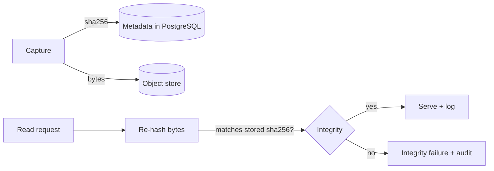

# Security Architecture

Security in ORCA is not a perimeter feature; it is a property of the data model. The
subject matter is sensitive and the cost of a corrupted or unexplained record is
high. This document describes the controls the system is designed around:
role-based access, evidence integrity, audit logging, encryption, and backup.

The skeleton implements the structure for these controls (roles, audit hooks, hash
fields). Production hardening is tracked in [`roadmap.md`](roadmap.md).

## Threat model (summary)

ORCA defends primarily against:

- **Silent evidence tampering** — an artifact or observation altered after the fact
  without a trace.
- **Unaccountable decisions** — a confirmation or deletion with no record of who did
  it or why.
- **Over-broad access** — any user being able to see or change anything.
- **Data loss** — evidence that cannot be recovered.

ORCA is explicitly **not** designed to support offensive operations, covert access,
or evasion. Those are out of scope by mission (see [`mission.md`](mission.md)).

## Role-based access control

Access is governed by roles. The skeleton defines three:

| Role       | Can do                                                                 |
| ---------- | --------------------------------------------------------------------- |
| `analyst`  | Create observations and entities, build cases and reports, submit relationships for review. |
| `reviewer` | Everything an analyst can do, plus approve/reject items in the review queue. |
| `admin`    | Everything a reviewer can do, plus user and role management and configuration. |

Principles:

- **Least privilege.** A role grants the minimum needed for its function.
- **Separation of duties.** Confirming a system-proposed relationship is a
  `reviewer` action, distinct from creating observations.
- **Authorization at the service boundary.** Permission checks live in the service
  layer, so they apply regardless of which API endpoint is used.

Authentication issues short-lived tokens; authorization maps the authenticated
identity to a role and checks it on every mutating operation. The skeleton stubs this
in `backend/app/core/security.py` and `backend/app/core/rbac.py`.

## Evidence integrity

Evidence is the most important data in the system, so it is the most strongly
protected.

- **Content addressing.** Every evidence artifact is hashed with SHA-256 at capture.
  The hash is stored in PostgreSQL alongside the metadata; the bytes are stored in the
  object store.
- **Verification on read.** When evidence is retrieved, the bytes are re-hashed and
  compared to the stored hash. A mismatch is an integrity failure and is surfaced, not
  hidden.
- **Immutability.** Evidence is write-once. There is no update path for evidence
  bytes or for the core fields of an observation. Corrections are *new* observations
  that reference the prior one.
- **Append-only observations.** Observations are never edited in place. The record
  reflects what was known and when.

## Audit logging

Every consequential action is recorded in an append-only audit log in PostgreSQL.

Logged actions include:

- confirming, rejecting, or flagging a review item,
- creating or deleting a case or report,
- any evidence integrity check that fails,
- role and permission changes.

Each audit entry records: the actor, the action, the target object, a timestamp, and
relevant context (for example, the prior and new status). The audit log is
append-only — there is no API to edit or delete entries. This is what makes principle
3 ("every assessment must be explainable") enforceable after the fact: a confirmed
relationship can always be traced to the person who confirmed it and the evidence
they saw.

## Encryption

- **In transit.** All client/server traffic is over TLS. Internal service-to-store
  connections use encrypted channels in deployed environments.
- **At rest.** PostgreSQL, Neo4j, and the object store are configured for encryption
  at rest in deployed environments. The object store holds the most sensitive bytes
  (evidence) and is encrypted with managed keys.
- **Secrets.** Credentials and keys are supplied through environment variables and a
  secret manager in deployment — never committed. `.env.example` files contain
  placeholders only.

## Backup and recovery

Evidence durability is a mission requirement, so backups are designed around it:

- **PostgreSQL** — regular automated backups with point-in-time recovery. The audit
  log and all object metadata are included.
- **Object store** — versioned, replicated storage for evidence bytes. Because
  evidence is content-addressed and immutable, restores are verifiable against the
  recorded hashes.
- **Neo4j** — periodic snapshots. Because the graph is a *derived projection* of
  PostgreSQL, it can also be rebuilt from the relational record if a backup is
  unavailable.
- **Restore testing** — recovery procedures are exercised, not assumed. A backup that
  has never been restored is not a backup.

## Data handling and minimization

- ORCA records observations and the evidence that supports them. It does not enrich
  records with data the analyst did not collect or import.
- Access to records is scoped by role; the audit log makes access to sensitive
  records reviewable.
- Retention and deletion policies are deployment-specific. Deleting a *case* never
  deletes underlying evidence (principle 8); deleting evidence, where permitted, is an
  audited admin action.

## What ORCA will not implement

To keep the boundaries in [`mission.md`](mission.md) enforceable, ORCA will not add:

- mechanisms to access systems or accounts without authorization,
- covert or real-time tracking of individuals,
- features whose purpose is to evade detection,
- or any automated process that produces a finding about a person.

Security review of changes should check proposals against these boundaries, not only
against vulnerability classes.
