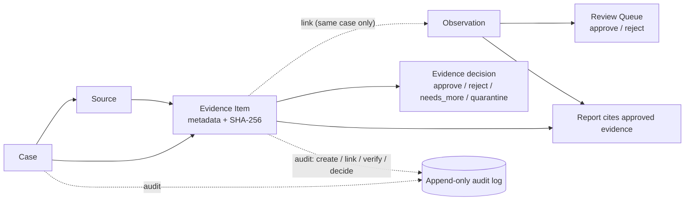

# v0.3 — Evidence Locker + Integrity Layer

v0.3 adds a safe, auditable evidence storage layer: source attribution, rich file
metadata, SHA-256 hashing with verification, chain-of-custody audit events, and report
citations. No scraping, dark-web collection, autonomous hunting, face search,
offender/victim targeting, or any CSAM storage/handling capability.

> **v0.7 update.** Real manual **file upload** now stores bytes through this same content
> store and integrity layer, with a safe-by-default upload policy (reject dangerous
> types, quarantine unknown types), role/case-scoped raw-byte download, and audited
> upload/download. See [`v0.7_evidence_file_upload.md`](v0.7_evidence_file_upload.md).

## The flow



## The EvidenceItem

| Field | Notes |
| ----- | ----- |
| `id` | evidence id |
| `case_id`, `source_id` | required; evidence is case-scoped and source-attributed |
| `observation_id` | optional; link only within the same case |
| `title`, `description`, `evidence_type` | `screenshot` / `document` / `image` / `video` / `web_archive` / `analyst_note` / `partner_file` / `other` |
| `storage_uri`, `original_filename`, `mime_type`, `size_bytes` | file metadata |
| `sha256`, `has_bytes` | integrity anchor; `has_bytes` indicates ORCA can re-verify |
| `captured_at`, `captured_by`, `access_method` | provenance |
| `legal_flags`, `handling_notes` | `lawful_basis` / `requires_legal_review` / `sensitive` / `partner_approved` |
| `status` | `proposed` / `approved` / `rejected` / `needs_more_review` / `quarantined` |
| `created_by`, `created_at` | record provenance |

## Endpoints (under `/api/v1`)

| Method & path | Purpose |
| ------------- | ------- |
| `POST /evidence` | Create an evidence item (hashes inline bytes if provided). |
| `GET  /cases/{id}/evidence` | List evidence in a case (the locker). |
| `GET  /evidence/{id}` | Get an evidence item. |
| `POST /evidence/{id}/link` | Link to an observation (same case only). |
| `POST /evidence/{id}/decision` | approve / reject / needs_more_review / quarantine. |
| `POST /evidence/{id}/verify` | Re-hash stored bytes and compare. |

## Walkthrough (curl) — Case → Source → Evidence → Observation → Review → Report

```bash
B=http://localhost:8000/api/v1

CASE=$(curl -s $B/cases -H 'content-type: application/json' \
  -d '{"title":"Locker demo","owner":"analyst"}' | jq -r .id)
SRC=$(curl -s "$B/sources" | jq -r '.[0].id')

# Observation in the case, approved via the review queue
E=$(curl -s $B/entities -H 'content-type: application/json' \
  -d '{"entity_type":"advertisement","value":"ad-9"}' | jq -r .id)
OBS=$(curl -s $B/observations -H 'content-type: application/json' -d "{
  \"case_id\":\"$CASE\",\"timestamp\":\"2026-01-01T00:00:00Z\",\"source_id\":\"$SRC\",
  \"collector\":\"analyst\",\"notes\":\"ad-9 seen\",\"confidence\":0.7,\"entity_ids\":[\"$E\"]}" | jq -r .id)
ITEM=$(curl -s "$B/review?case_id=$CASE" | jq -r ".[] | select(.subject_id==\"$OBS\") | .id")
curl -s $B/review/$ITEM/decision -H 'content-type: application/json' -d '{"decision":"approve"}' >/dev/null

# Evidence item: ORCA hashes the inline content (SHA-256), then we link + verify + approve
EV=$(curl -s $B/evidence -H 'content-type: application/json' -d "{
  \"case_id\":\"$CASE\",\"source_id\":\"$SRC\",\"title\":\"Analyst note on ad-9\",
  \"evidence_type\":\"analyst_note\",\"content_text\":\"ad-9 lists +1 555 555 0142\",
  \"legal_flags\":{\"lawful_basis\":\"publicly available information\"}}" | jq -r .id)

curl -s $B/evidence/$EV/link -H 'content-type: application/json' -d "{\"observation_id\":\"$OBS\"}" | jq '.observation_id'
curl -s $B/evidence/$EV/verify -X POST | jq '{verified, computed_sha256}'    # -> verified: true
curl -s $B/evidence/$EV/decision -H 'content-type: application/json' -d '{"decision":"approve"}' | jq '.status'

# Report cites the approved observation and its approved evidence
curl -s $B/cases/$CASE/report -X POST | jq -r .body
# Case audit log shows the full chain of custody
curl -s $B/cases/$CASE/audit | jq '.[].action'
```

Observed evidence audit actions for one item:

```
evidence.created → evidence.linked → evidence.verified → evidence.approve
```

## Verified guarantees (from the test suite)

`tests/backend/test_evidence_locker.py` proves:

1. **Evidence creation writes an audit event.**
2. **SHA-256 is deterministic and verified** — identical bytes yield identical hashes;
   verify re-hashes the stored bytes and confirms a match (or reports a mismatch).
3. **Rejected / quarantined evidence is excluded from reports.**
4. **Report drafts cite only approved observations and approved evidence** (evidence
   under a non-approved observation is also excluded).
5. **Evidence cannot be linked across unrelated cases** (HTTP 422).
6. **Every evidence status change writes an audit event** (approve / reject /
   needs_more_review / quarantine).

The PostgreSQL integration test (`test_postgres_integration.py`) exercises evidence
create → link → verify → approve → report citation against a live database.

## Frontend

- **Evidence Locker** tab on Case Detail: title, type, source, status, hash, capture
  time, handling flags, linked observation, and a **Verify hash** control with inline
  ✓ verified / ✗ mismatch / — no-bytes states. Per-item decide buttons (approve /
  reject / needs more / quarantine).
- **Evidence Intake** form with the required safety warnings and a confirmation gate.
- Report tab shows the **evidence citations** generated into the draft.

## Safety

The Evidence Locker is for metadata, lawful files, and partner-approved workflows
only. See [`safety_and_handling.md`](safety_and_handling.md). No CSAM, no illegally
obtained material, no unauthorized private/personal material; urgent or illegal content
must be reported through authorized channels.
